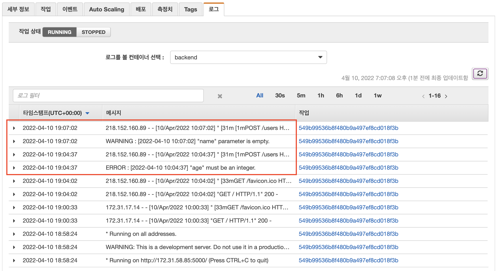

# Logging

2가지 에러에 대해서 각각 적절한 에러 수준으로 로그 기록됨

# Monitoring

- Server, DB 각각 시간에 따른 CPU 사용량 그래프
- 분당 최대 응답 속도 시간, 평균 응답 속도 시간
- 분당 500 에러 개수, request 총 개수
- "age" must be an integer. 에러 개수
- DB에 적재된 user 총 개수

위 사항들을 포함하여 대시보드 제작

# Alerting

> ECS => CloudWatch => AWS SNS => AWS Lambda => Slack

- CloudWatch 가 ECS로부터 이상지표 탐지 후 SNS에 publishing
- SNS에 올라온 메시지를 Lambda가 구독함
- Lambda에서 slack으로 알람 전달
