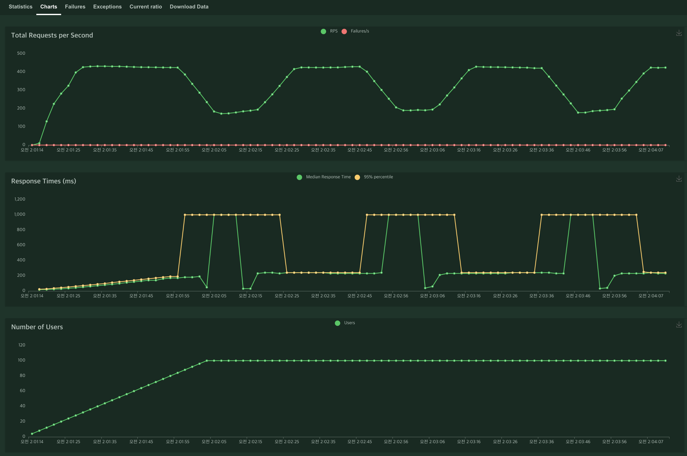
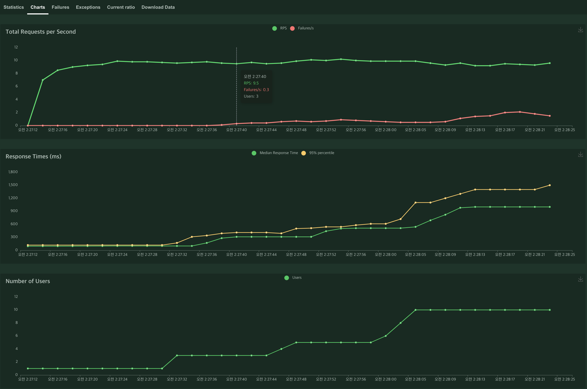
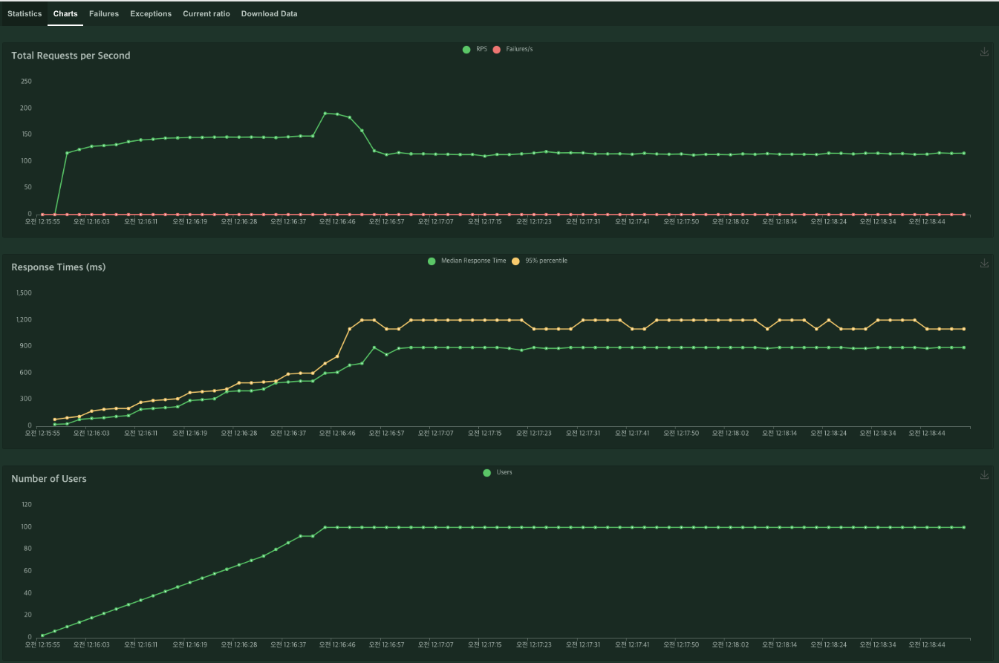
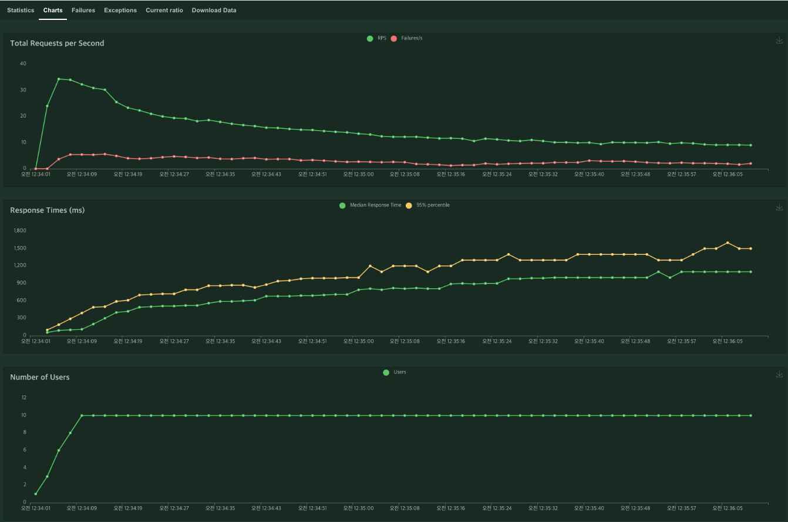

# Performance Test

use locust

|                | 최대 동시 접속자 수 | 응답시간 측정    | 단위시간당 최대 처리량 |
| -------------- | ------------------- | ---------------- | ---------------------- |
| EC2 - db read  | 80                  | 100명 기준 240ms | 425개                  |
| EC2 - db write | 10                  | 10명 기준 900ms  | 10개                   |
| ECS - db read  | 테스트1             | 테스트2          | 테스트3                |
| ECS - db write | 테스트1             | 테스트2          | 테스트3                |

### EC2 (DB-READ) Performance

- 80명까지는 큰 무리없이 전부 처리 가능
- 80명 시점부터 spiking 현상이 일어남. DB에 read operation이 너무 쌓여 병목 발생.
- 100명 기준 평균적으로 240ms 안에 응답 돌아옴.

### EC2 (DB-WRITE) Performance

- 3명부터 바로 failure 발생
- 3명부터 response time이 급격히 증가하며 10명 기준 거의 1초에 가까운 시간이 걸림.
- 단위시간당 처리량은 read에 비해 압도적으로 적음.

### ECS (DB-READ) Performance

### ECS (DB-WRITE) Performance

